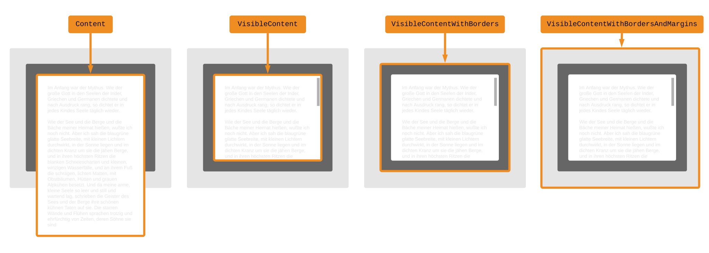

# Boundaries

The `Browser.Dom` module allows you to get the size of specific DOM nodes. This is more complex than it sounds though!

Let&rsquo;s see why by looking at this diagram of a DOM node:

There are actually a bunch of sizes we might care about!

The [`Boundary`](https://package.elm-lang.org/packages/elm/browser/latest/Browser-Dom#Boundary) type lets you pick exactly which boundary you care about:

These boundaries have some pretty confusing names in JavaScript, but I will include them here for people who want to be extra certain of what they are getting:

- `Content` uses `scrollWidth` and `scrollHeight`
- `VisibleContent` uses `clientWidth` and `clientHeight`
- `VisibleContentWithBorders` uses `offsetWidth` and `offsetHeight`
- `VisibleContentWithBordersAndMargins` uses `getBoundingClientRect()`
